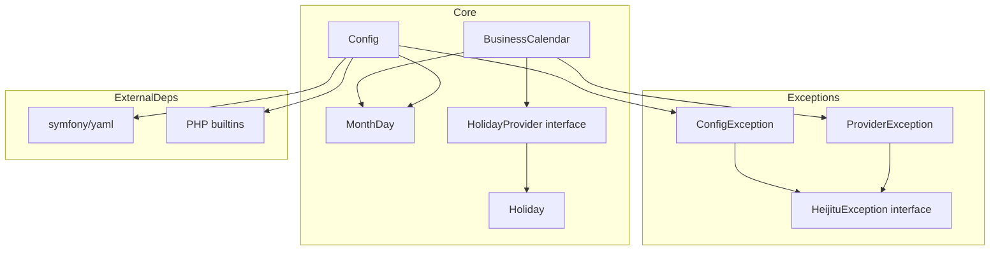
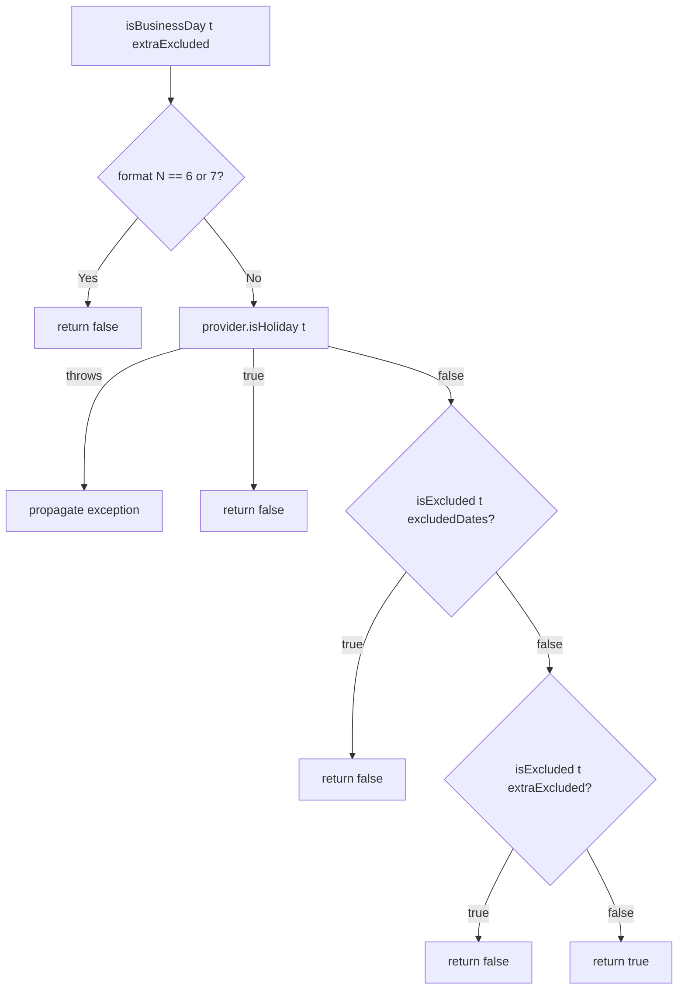
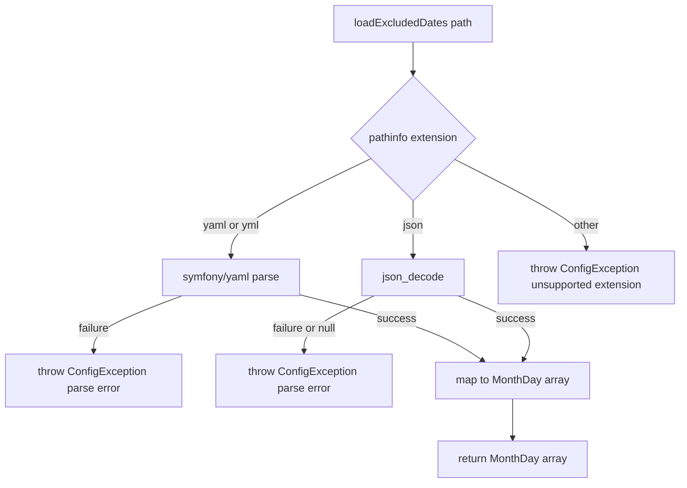
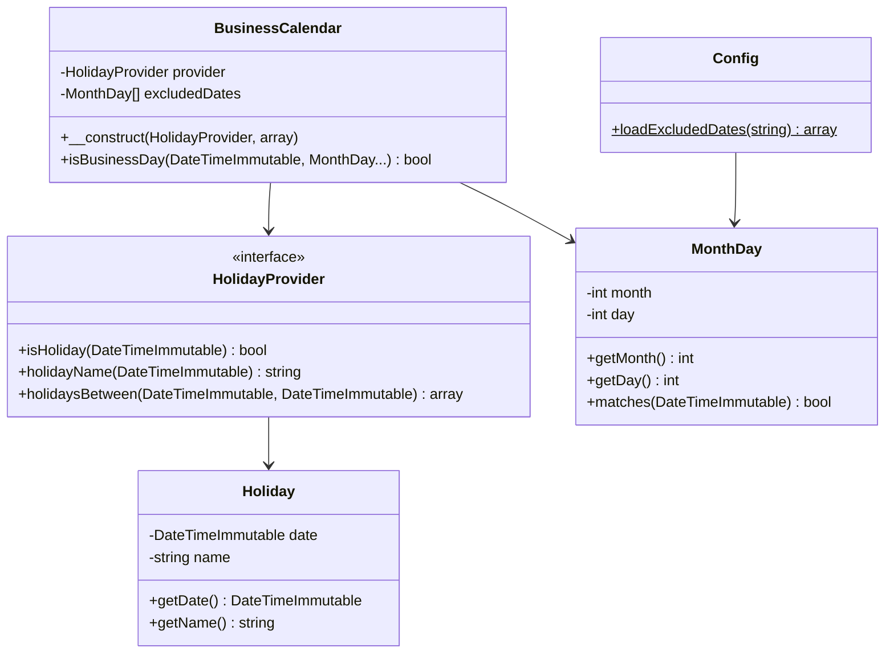

# 設計書: Step 1 — プロジェクト初期化 + コア実装

## Overview

本ステップは、日本の営業日計算ライブラリ `php-heijitu`（`go-heijitu` の PHP 移植版）の骨格を構築する。コア型（`MonthDay`・`Holiday`）、プロバイダー抽象（`HolidayProvider` インターフェース）、`BusinessCalendar` クラス（`isBusinessDay` まで）、設定ファイル読み込み（`Config`）、例外型（3 クラス）、および開発環境（Docker 2 サービス）を実装する。

**対象利用者**: PHP ライブラリ利用者。`composer.json` に依存追加のみで php-heijitu を組み込み、祝日プロバイダーを差し替えながら営業日判定を行う。

**影響範囲**: 完全 greenfield。既存実装への影響なし。本ステップで確定するインターフェース（`HolidayProvider`・`BusinessCalendar` のコンストラクタシグネチャ）が後続ステップ（Step 2〜4 のプロバイダー実装）の契約となる。

### Goals
- `composer install` が通る Composer パッケージ定義を作成する（`suggest`/`require-dev` 分離・PSR-4）
- PHP 7.4 構文のみで書き、8.1 で deprecation 警告ゼロを保証する
- `isBusinessDay()` の判定ロジック（土日・祝日・除外日付・extraExcluded）をモックプロバイダーでテストできる状態にする
- Docker 2 サービス（php74 / php81）で PHPUnit テストが両バージョン通ることを確認できる開発環境を用意する

### Non-Goals
- 実プロバイダー実装（HolidayJp / CaoCsv / GoogleCalendar）— Step 2〜4
- `isBusinessDay` 以外の API（nextBusinessDay / firstBusinessDayOfMonth / firstBusinessDaysOfYear / holidays）— Step 2
- PHPDoc・examples・README — Step 5
- Packagist 登録・タグ付けリリース工程 — なし（GitHub VCS 配布のみ）

---

## Boundary Commitments

### This Spec Owns
- `composer.json`・`phpunit.xml`・`.gitignore` のプロジェクト初期設定
- `src/` 配下の全コアクラス（`MonthDay`・`Holiday`・`HolidayProvider`・`Config`・`BusinessCalendar`）
- `src/Exception/` 配下の例外型（`HeijituException`・`ConfigException`・`ProviderException`）
- `tests/` 配下のコアテスト（`MonthDayTest`・`ConfigTest`・`BusinessCalendarTest`）とテストフィクスチャ
- `docker/` の開発環境定義（Dockerfile・compose.yaml）
- `HolidayProvider` インターフェースの契約定義（後続ステップが実装する）

### Out of Boundary
- 実プロバイダーのクラス定義・実装・テスト（`src/Providers/` 配下はこのステップで作成しない）
- Step 2 以降の API メソッド（nextBusinessDay 等）
- ライブラリが内部で日付を生成する処理（Step 2 で発生）のタイムゾーン処理
- PHPDoc コメント・examples・ドキュメント類

### Allowed Dependencies
- PHP 標準ライブラリ（`DateTimeImmutable`・`json_decode`・`file_get_contents` 等）
- `symfony/yaml ^5.4`（require-dev に追加、Config の YAML 読み込みに使用）
- `phpunit/phpunit ^9.6`（require-dev）
- Docker 公式イメージ（php:7.4-cli / php:8.1-cli）

### Revalidation Triggers
- `HolidayProvider` インターフェースのメソッドシグネチャを変更した場合 → Step 2〜4 のプロバイダー実装を再確認
- `BusinessCalendar` コンストラクタシグネチャを変更した場合 → Step 2 以降のテストを再確認
- `MonthDay` または `Holiday` の公開 API を変更した場合 → 全ステップを再確認
- 例外型の継承関係を変更した場合 → Step 2〜4 の例外処理を再確認

---

## Architecture

### Architecture Pattern & Boundary Map

本ライブラリは **値オブジェクト + インターフェース + ストラテジーパターン** を採用する。`HolidayProvider` インターフェースがストラテジーの差し替え口となり、`BusinessCalendar` がコンテキストクラスとして機能する。



**依存方向（厳守）**:
```
Exception/* → (なし)
MonthDay    → (なし)
Holiday     → (なし)
HolidayProvider → Holiday
Config      → MonthDay, ConfigException, symfony/yaml
BusinessCalendar → HolidayProvider, MonthDay, ProviderException
```

上位レイヤーは下位レイヤーのみをインポートする。逆方向の依存は許可しない。

### Technology Stack

| Layer | Choice / Version | Role | Notes |
|-------|-----------------|------|-------|
| Runtime | PHP `^7.4 \|\| ^8.0 \|\| ^8.1` | ライブラリ実行環境 | 7.4 構文のみ使用、8.1 deprecation 警告ゼロ |
| Package | Composer 2 | 依存管理・PSR-4 オートロード | `require` に PHP のみ、他は `suggest`/`require-dev` |
| Testing | phpunit/phpunit `^9.6` | 単体テスト | 7.4/8.1 両対応の唯一の系列 |
| Config (YAML) | symfony/yaml `^5.4` | YAML 設定ファイルのパース | `require-dev` 兼 `suggest`。7.4/8.1 対応は v5.4 のみ |
| Dev Infra | Docker（php:7.4-cli / php:8.1-cli 公式イメージ + Composer 2） | 7.4/8.1 デュアルバージョン開発・テスト環境 | `dev-environment.md` 参照。`composer install` は php74 サービスで実行（7.4 基準で `composer.lock` を生成） |

---

## File Structure Plan

### Directory Structure

```
php-heijitu/
├── composer.json                        # パッケージ定義（名前・バージョン制約・PSR-4・依存）
├── phpunit.xml                          # PHPUnit 設定（テストスイート・bootstrap）
├── docker/
│   ├── Dockerfile                       # ARG PHP_VERSION で 7.4/8.1 切替、mbstring 導入
│   └── compose.yaml                     # php74 / php81 の 2 サービス
├── src/
│   ├── Exception/
│   │   ├── HeijituException.php         # マーカーインターフェース（本ライブラリ例外の共通型）
│   │   ├── ConfigException.php          # \RuntimeException + HeijituException（設定読み込み失敗）
│   │   └── ProviderException.php        # \RuntimeException + HeijituException（プロバイダー失敗）
│   ├── MonthDay.php                     # final class — 月日値オブジェクト + matches()
│   ├── Holiday.php                      # final class — 祝日値オブジェクト（date + name）
│   ├── HolidayProvider.php             # interface — isHoliday / holidayName / holidaysBetween
│   ├── Config.php                       # final class — static loadExcludedDates()
│   └── BusinessCalendar.php            # final class — コンストラクタ + isBusinessDay()
└── tests/
    ├── MonthDayTest.php                 # MonthDay::matches() 全パターン
    ├── ConfigTest.php                   # Config::loadExcludedDates() YAML/JSON/エラー系
    ├── BusinessCalendarTest.php         # isBusinessDay() 全条件（匿名クラスモック使用）
    └── testdata/
        ├── config.yaml                  # YAML テストフィクスチャ（excluded_dates あり）
        └── config.json                  # JSON テストフィクスチャ（excluded_dates あり）
```

### Modified Files
なし（完全 greenfield）

---

## System Flows

### isBusinessDay 判定フロー



### Config::loadExcludedDates フロー



---

## Requirements Traceability

| 要件 | 概要 | コンポーネント | 備考 |
|------|------|--------------|------|
| 1.1, 1.2, 1.3, 1.4, 1.5, 1.6 | パッケージ名・PHP制約・PSR-4・suggest/require-dev・コアクラス単独インストール | `composer.json` | |
| 2.1, 2.2, 2.3 | 7.4構文のみ・8.1 deprecation ゼロ・両バージョンテスト通過 | 全ファイル・Docker | Docker 2 サービスで検証 |
| 3.1, 3.2, 3.3, 3.4 | MonthDay 値オブジェクト・matches()・バリデーションなし | `MonthDay` | |
| 4.1 | Holiday 値オブジェクト | `Holiday` | |
| 5.1, 5.2, 5.3, 5.4, 5.5, 5.6, 5.7 | HolidayProvider IF 3 メソッド・戻り値仕様・例外伝播 | `HolidayProvider` | ctx 削除・例外モデル |
| 6.1, 6.2, 6.3, 6.4, 6.5 | BC コンストラクタ・除外日付登録・設定ローダー・マージ・null 型排除 | `BusinessCalendar`・`Config` | |
| 7.1, 7.2, 7.3, 7.4, 7.5, 7.6, 7.7 | isBusinessDay 全判定条件・引数 TZ 尊重・例外伝播 | `BusinessCalendar` | |
| 8.1, 8.2, 8.3, 8.4, 8.5 | YAML/JSON 拡張子判別・excluded_dates パース・ConfigException | `Config` | |
| 9.1, 9.2, 9.3, 9.4, 9.5 | HeijituException IF・ConfigException・ProviderException・InvalidArgumentException | `Exception/*` | |

---

## Components and Interfaces

### コンポーネント概要

| コンポーネント | レイヤー | Intent | 要件カバレッジ | 主要依存 (P0/P1) |
|--------------|---------|--------|-------------|----------------|
| `HeijituException` | Exception | 本ライブラリ例外のマーカーIF | 9.1 | — |
| `ConfigException` | Exception | 設定読み込み失敗例外 | 9.2, 9.3 | `HeijituException` (P0) |
| `ProviderException` | Exception | プロバイダー失敗例外 | 9.2, 9.4 | `HeijituException` (P0) |
| `MonthDay` | Core Type | 年をまたぐ月日値オブジェクト | 3.1–3.4 | — |
| `Holiday` | Core Type | 祝日値オブジェクト | 4.1 | — |
| `HolidayProvider` | Interface | 祝日判定の差し替え口 | 5.1–5.7 | `Holiday` (P0) |
| `Config` | Config Loader | YAML/JSON 設定ファイル読み込み | 8.1–8.5 | `MonthDay` (P0), `ConfigException` (P0) |
| `BusinessCalendar` | Core Logic | 営業日判定本体 | 6.1–6.5, 7.1–7.7 | `HolidayProvider` (P0), `MonthDay` (P0) |

---

### Exception Layer

#### HeijituException

| Field | Detail |
|-------|--------|
| Intent | 本ライブラリが投げる例外の共通マーカー型 |
| Requirements | 9.1 |

**Responsibilities & Constraints**
- `interface HeijituException`（メソッドなし）
- 利用者は `catch (HeijituException $e)` で全ライブラリ例外を一括捕捉できる
- このインターフェース自体をインスタンス化したり `throw` したりしない

**Contracts**: Service [ ] / API [ ] / Event [ ] / Batch [ ] / State [ ]

```php
namespace Heijitu\Exception;

interface HeijituException
{
}
```

---

#### ConfigException

| Field | Detail |
|-------|--------|
| Intent | 設定ファイルの読み込み・パース・拡張子検証の失敗を表す |
| Requirements | 9.2, 9.3 |

**Responsibilities & Constraints**
- `extends \RuntimeException implements HeijituException`
- 投げるケース: ファイル読み込み失敗、YAML/JSON パース失敗、未対応拡張子
- 追加メソッドなし（`\RuntimeException` の message/code/previous を継承）

```php
namespace Heijitu\Exception;

class ConfigException extends \RuntimeException implements HeijituException
{
}
```

---

#### ProviderException

| Field | Detail |
|-------|--------|
| Intent | プロバイダーのデータ取得・API 呼び出し・認証情報不備の失敗を表す |
| Requirements | 9.2, 9.4 |

**Responsibilities & Constraints**
- `extends \RuntimeException implements HeijituException`
- Step 2 以降のプロバイダー実装から throw される（Step 1 では定義のみ）
- 追加メソッドなし

```php
namespace Heijitu\Exception;

class ProviderException extends \RuntimeException implements HeijituException
{
}
```

---

### Core Types Layer

#### MonthDay

| Field | Detail |
|-------|--------|
| Intent | 年をまたいで有効な月日を表す不変値オブジェクト |
| Requirements | 3.1–3.4 |

**Responsibilities & Constraints**
- `final class MonthDay`（継承禁止）
- `month`（int）・`day`（int）を private プロパティとして保持し getter を公開
- バリデーションなし（go-heijitu 踏襲）— 存在しない日付（例: 2月30日）は `matches()` が常に `false` を返す
- PHP 7.4: 型付きプロパティ（`private int $month`）使用可

**Contracts**: Service [ ] / API [ ] / Event [ ] / Batch [ ] / State [ ]

```php
namespace Heijitu;

final class MonthDay
{
    private int $month;
    private int $day;

    public function __construct(int $month, int $day)
    {
        $this->month = $month;
        $this->day   = $day;
    }

    public function getMonth(): int { return $this->month; }
    public function getDay(): int   { return $this->day; }

    // 年を無視して月・日のみ照合
    // @param DateTimeImmutable $t
    public function matches(\DateTimeImmutable $t): bool
    {
        return (int) $t->format('n') === $this->month
            && (int) $t->format('j') === $this->day;
    }
}
```

- `format('n')` は月（1〜12）、`format('j')` は日（1〜31）（ゼロ埋めなし）

---

#### Holiday

| Field | Detail |
|-------|--------|
| Intent | 祝日の日付と名称を保持する不変値オブジェクト |
| Requirements | 4.1 |

**Responsibilities & Constraints**
- `final class Holiday`
- `date`（DateTimeImmutable）・`name`（string）を private プロパティとして保持し getter を公開

**Contracts**: Service [ ] / API [ ] / Event [ ] / Batch [ ] / State [ ]

```php
namespace Heijitu;

final class Holiday
{
    private \DateTimeImmutable $date;
    private string $name;

    public function __construct(\DateTimeImmutable $date, string $name)
    {
        $this->date = $date;
        $this->name = $name;
    }

    public function getDate(): \DateTimeImmutable { return $this->date; }
    public function getName(): string             { return $this->name; }
}
```

---

### Interface Layer

#### HolidayProvider

| Field | Detail |
|-------|--------|
| Intent | 祝日判定実装の差し替え口（ストラテジーパターンの抽象） |
| Requirements | 5.1–5.7 |

**Responsibilities & Constraints**
- `interface HolidayProvider`
- Go 版からの変更: `context.Context` 引数を削除、`(T, error)` 多値返却を `T` + 例外送出に変換
- `holidayName` は非祝日のとき空文字 `""` を返す（例外にしない）
- `holidaysBetween` は両端を含み昇順で返す。`$from > $to` のとき空配列を返す
- 実装失敗は `throw` で伝播（握りつぶし禁止）

**Contracts**: Service [x] / API [ ] / Event [ ] / Batch [ ] / State [ ]

```php
namespace Heijitu;

interface HolidayProvider
{
    /**
     * @throws \Heijitu\Exception\ProviderException データ取得失敗時
     */
    public function isHoliday(\DateTimeImmutable $t): bool;

    /**
     * 非祝日のとき空文字 "" を返す（例外にしない）
     * @throws \Heijitu\Exception\ProviderException データ取得失敗時
     */
    public function holidayName(\DateTimeImmutable $t): string;

    /**
     * from〜to（両端含む）の祝日を日付昇順で返す
     * from > to のとき空配列を返す
     * @return Holiday[]
     * @throws \Heijitu\Exception\ProviderException データ取得失敗時
     */
    public function holidaysBetween(\DateTimeImmutable $from, \DateTimeImmutable $to): array;
}
```

---

### Config Loader Layer

#### Config

| Field | Detail |
|-------|--------|
| Intent | YAML/JSON 設定ファイルから MonthDay[] を読み込む静的ファクトリ |
| Requirements | 8.1–8.5 |

**Responsibilities & Constraints**
- `final class Config`（インスタンス化不要・静的ファクトリのみ）
- 拡張子で形式を判別（`.yaml`・`.yml` → symfony/yaml、`.json` → `json_decode`）
- 未対応拡張子・読み込み失敗・パース失敗は `ConfigException` を throw
- `symfony/yaml` は `require-dev` に追加済み。`suggest` として利用者に案内するが、本ステップでは開発用に存在する

**Dependencies**
- External: `symfony/yaml ^5.4` — YAML パース (P0、YAML 設定使用時)
- External: PHP 標準 `json_decode` — JSON パース (P0)

**Contracts**: Service [x] / API [ ] / Event [ ] / Batch [ ] / State [ ]

```php
namespace Heijitu;

final class Config
{
    /**
     * 設定ファイルを読み込み MonthDay[] を返す
     * @return MonthDay[]
     * @throws \Heijitu\Exception\ConfigException 読み込み・パース失敗時
     */
    public static function loadExcludedDates(string $path): array
    {
        // 1. ファイル読み込み（失敗時 ConfigException）
        // 2. 拡張子判別（未対応時 ConfigException）
        // 3. パース（失敗時 ConfigException）
        // 4. excluded_dates[] を MonthDay[] に変換して返す
    }
}
```

- `symfony/yaml` が未導入の状態で YAML ファイルを渡した場合: `class_exists(\Symfony\Component\Yaml\Yaml::class)` で検出し `ConfigException`（「`composer require symfony/yaml` が必要」）を throw する（可能なら実施・decisions.md H）

---

### Business Logic Layer

#### BusinessCalendar

| Field | Detail |
|-------|--------|
| Intent | 祝日プロバイダーと除外日付を保持し isBusinessDay を提供する営業日計算の中核 |
| Requirements | 6.1–6.5, 7.1–7.7 |

**Responsibilities & Constraints**
- `final class BusinessCalendar`
- コンストラクタは `HolidayProvider $provider`（非 nullable 型宣言で null 排除）と `array $excludedDates = []` を受け取る
- `isBusinessDay()` は引数の `DateTimeImmutable` が持つタイムゾーンを尊重する（内部で TZ を変更しない）
- Step 1 スコープ外の API（nextBusinessDay 等）は実装しない

**Dependencies**
- Inbound: 利用者コード — BusinessCalendar を構築して isBusinessDay を呼ぶ (P0)
- Outbound: `HolidayProvider` — isHoliday を呼ぶ (P0)
- Outbound: `MonthDay::matches()` — 除外日付チェック (P0)

**Contracts**: Service [x] / API [ ] / Event [ ] / Batch [ ] / State [ ]

```php
namespace Heijitu;

final class BusinessCalendar
{
    private HolidayProvider $provider;
    /** @var MonthDay[] */
    private array $excludedDates;

    /**
     * @param MonthDay[] $excludedDates
     * @throws \InvalidArgumentException 要素が MonthDay でない場合（9.5）
     */
    public function __construct(HolidayProvider $provider, array $excludedDates = [])
    {
        foreach ($excludedDates as $item) {
            if (!($item instanceof MonthDay)) {
                throw new \InvalidArgumentException(
                    'All elements of $excludedDates must be MonthDay instances'
                );
            }
        }
        $this->provider      = $provider;
        $this->excludedDates = $excludedDates;
    }

    /**
     * @param MonthDay ...$extraExcluded この呼び出し限りの追加除外日付
     * @throws \Heijitu\Exception\ProviderException プロバイダー失敗時
     */
    public function isBusinessDay(\DateTimeImmutable $t, MonthDay ...$extraExcluded): bool
    {
        // 1. 土日チェック: format('N') が 6(土) または 7(日) なら false
        // 2. provider.isHoliday($t)：true なら false、例外はそのまま伝播
        // 3. $this->excludedDates で isExcluded チェック：一致なら false
        // 4. $extraExcluded で isExcluded チェック：一致なら false
        // 5. すべて非該当なら true
    }

    /** @param MonthDay[] $dates */
    private function isExcluded(\DateTimeImmutable $t, array $dates): bool
    {
        foreach ($dates as $md) {
            if ($md->matches($t)) {
                return true;
            }
        }
        return false;
    }
}
```

- `format('N')` は ISO 8601 曜日番号（月=1〜日=7）。土=6、日=7。
- `$excludedDates` の型は配列（PHP 7.4 では `MonthDay[]` を型宣言できないため PHPDoc で表現）。コンストラクタで `instanceof MonthDay` チェックを行い、非 MonthDay 要素は即座に `\InvalidArgumentException` を throw する（要件 9.5）

**Implementation Notes**
- `HolidayProvider $provider` は非 nullable 型宣言により `null` を渡した瞬間に PHP が TypeError を投げる（go の panic 相当）
- `isExcluded` は `$excludedDates` と `$extraExcluded` 両方に使う共通ヘルパー（重複排除）
- `extraExcluded` は可変長引数（`MonthDay ...$extraExcluded`）— PHP 7.4 で使用可能

---

## Data Models

### Domain Model

本ステップで扱うデータ型はすべて **値オブジェクト**（不変・同一性は値で判断）。集約や永続化は発生しない。



### 設定ファイル構造（YAML / JSON）

YAML:
```yaml
excluded_dates:
  - month: 8
    day: 15
  - month: 12
    day: 31
```

JSON:
```json
{
  "excluded_dates": [
    {"month": 8, "day": 15},
    {"month": 12, "day": 31}
  ]
}
```

`excluded_dates` の各エントリは `month`（int, 1〜12）と `day`（int, 1〜31）を持つ。バリデーションなし（go-heijitu 踏襲）。

---

## Error Handling

### Error Strategy

本ライブラリの誤りは **プログラマエラー** と **実行時エラー** の 2 種に分類する。

| カテゴリ | 型 | 例 | 対処 |
|---------|----|----|------|
| プログラマエラー | `\TypeError`（PHP の型宣言違反） | `null` を HolidayProvider に渡す | PHP ランタイムが自動投げる（コードで対処不要） |
| プログラマエラー | `\InvalidArgumentException` | 型宣言で防げない不正引数 | 即 throw（9.5） |
| 設定エラー | `ConfigException` | ファイル読み込み失敗・パース失敗・未対応拡張子 | `Config::loadExcludedDates()` が throw |
| プロバイダーエラー | `ProviderException` | API 失敗・認証不備（Step 2〜4 で発生） | Step 1 では定義のみ |

### Error Categories and Responses

**ConfigException の throw ケース**:
- `file_get_contents($path)` が失敗（ファイル非存在・権限なし）
- 拡張子が `.yaml`・`.yml`・`.json` 以外
- symfony/yaml のパース例外
- `json_decode` が `null` を返す（パース失敗）
- symfony/yaml が未インストール（`class_exists` で検出、可能なら実施）

**エラーの握りつぶし禁止**: プロバイダーが throw した例外は `BusinessCalendar::isBusinessDay()` でキャッチせず、そのまま呼び出し元へ伝播する。

---

## Testing Strategy

### Unit Tests

1. **MonthDayTest** — `matches()` のパターン網羅（要件 3.1–3.4）
   - 月・日が一致するとき `true`（異なる年でも）
   - 月が不一致のとき `false`
   - 日が不一致のとき `false`
   - 存在しない月日（2月30日）が `false`
   - うるう年の 2月29日は一致する年に `true`、平年に `false`

2. **ConfigTest** — `Config::loadExcludedDates()` の全分岐（要件 8.1–8.5）
   - YAML ファイルから `MonthDay[]` を正しく読み込む
   - JSON ファイルから `MonthDay[]` を正しく読み込む
   - 未対応拡張子で `ConfigException` を throw する
   - 不正フォーマット内容で `ConfigException` を throw する
   - 存在しないファイルで `ConfigException` を throw する

3. **BusinessCalendarTest** — `isBusinessDay()` 全条件（要件 6.1–6.5, 7.1–7.7）  
   テストごとに匿名クラスで `HolidayProvider` を実装してモックとして使用する。
   - 土曜日に `false` を返す
   - 日曜日に `false` を返す
   - プロバイダーが `isHoliday = true` の日に `false` を返す
   - `excludedDates` に一致する日に `false` を返す（コンストラクタ引数指定）
   - `excludedDates` に一致する日に `false` を返す（Config ファイルからのマージ）
   - `extraExcluded` に一致する日に `false` を返す（当該呼び出し限り）
   - `extraExcluded` が他の呼び出しに影響しないこと
   - 平日・非祝日・除外なしの場合 `true` を返す
   - プロバイダーが例外を throw した場合 `isBusinessDay()` が伝播する

### モックプロバイダーの方式

**匿名クラスを用いる**（PHPUnit `createMock` より可読性が高く、PHPUnit バージョン依存が小さい）:

```php
$provider = new class implements HolidayProvider {
    public function isHoliday(\DateTimeImmutable $t): bool { return false; }
    public function holidayName(\DateTimeImmutable $t): string { return ''; }
    public function holidaysBetween(\DateTimeImmutable $from, \DateTimeImmutable $to): array { return []; }
};
```

特定の日を祝日とするモックは `__construct` でデータを渡すか、各テストメソッド内でクロージャを持つ匿名クラスを定義する。
