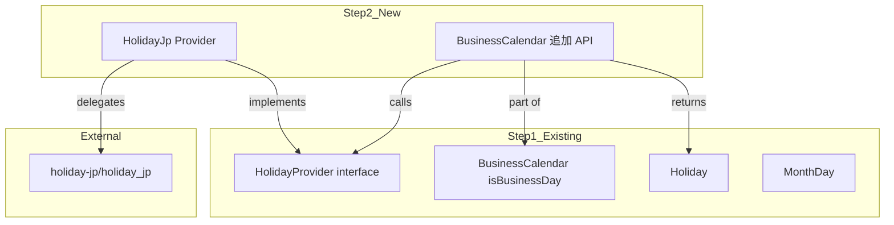
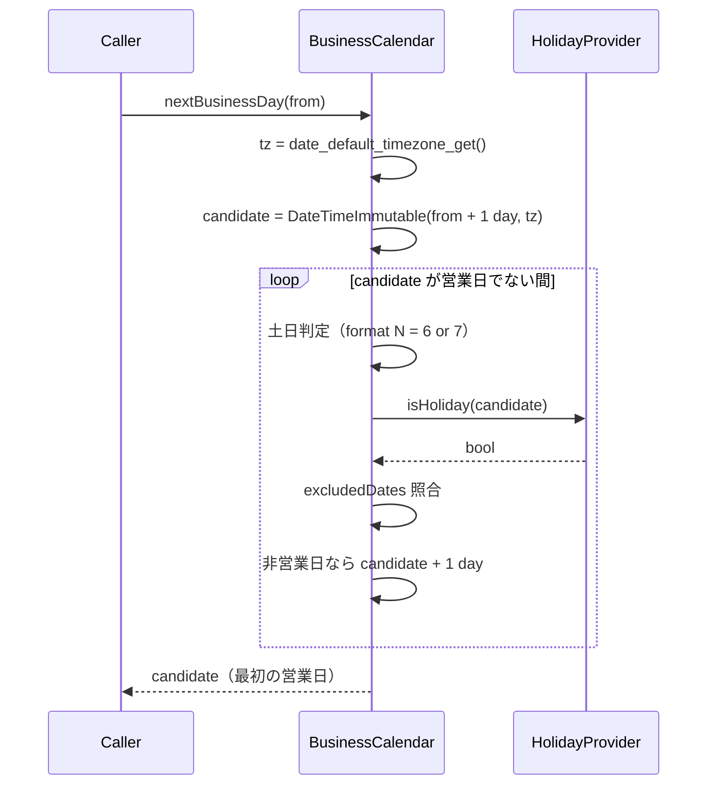
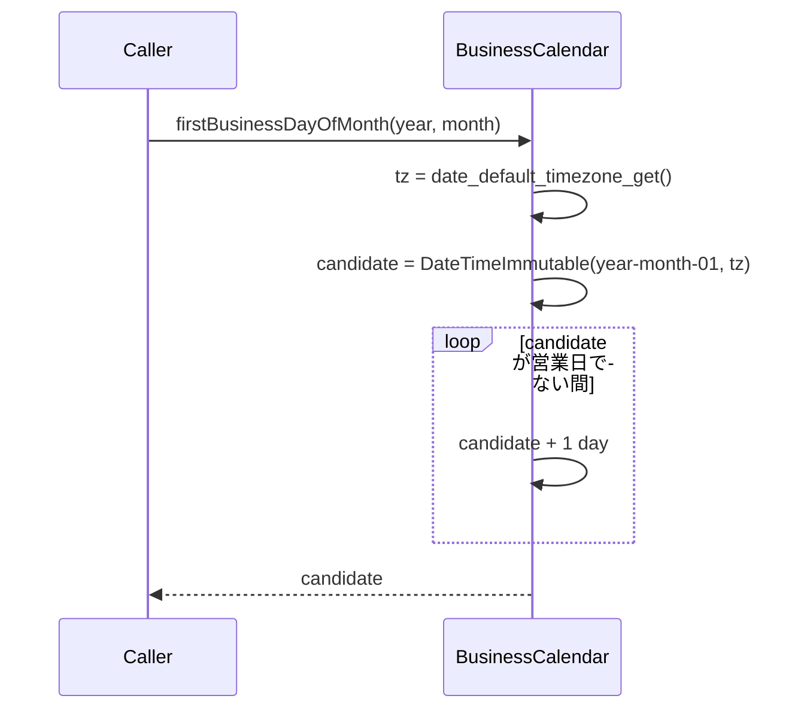

# 設計書: Step 2 — holidayjp プロバイダー + 残り全 API 実装

## Overview

Step 1 で構築した `php-heijitu` のコア（`HolidayProvider` インターフェース・`BusinessCalendar::isBusinessDay()`）を基盤に、デフォルト祝日プロバイダー（`HolidayJp\Provider`）と `BusinessCalendar` の残り 4 API を実装する。

**ユーザー**: ライブラリ利用者は、外部 API 接続なしに日本の祝日データで全営業日計算 API を使えるようになる。  
**影響**: `BusinessCalendar` が完全な公開 API セットを持ち、ライブラリとして実用可能な状態になる。

### Goals

- `HolidayJp\Provider` を `HolidayProvider` インターフェースに準拠した形で実装する
- `nextBusinessDay` / `firstBusinessDayOfMonth` / `firstBusinessDaysOfYear` / `holidays` を `BusinessCalendar` に追加する
- 全 API のテストを PHPUnit で作成し、PHP 7.4 / 8.1 両方で通過させる

### Non-Goals

- `CaoCsv` プロバイダー・`GoogleCalendar` プロバイダーの実装（Step 3・4）
- PHPDoc・README・examples 等のドキュメント整備（Step 5）

---

## Boundary Commitments

### This Spec Owns

- `src/Providers/HolidayJp/Provider.php` — `HolidayProvider` の実装（`holiday-jp/holiday_jp` への委譲ラッパー）
- `BusinessCalendar` への 4 メソッド追加（`nextBusinessDay` / `firstBusinessDayOfMonth` / `firstBusinessDaysOfYear` / `holidays`）
- `tests/Providers/HolidayJp/ProviderTest.php` — プロバイダーテスト
- `tests/BusinessCalendarTest.php` への残り API テスト追記

### Out of Boundary

- `CaoCsv` / `GoogleCalendar` プロバイダー（Step 3・4）
- `HolidayProvider` インターフェース定義（Step 1 確定済み・変更しない）
- `BusinessCalendar` のコンストラクタ・`isBusinessDay()`（Step 1 確定済み・変更しない）
- `Config.php`・例外型（Step 1 確定済み・変更しない）
- PHPDoc・README・examples（Step 5）

### Allowed Dependencies

- Step 1 の成果物: `HolidayProvider`（interface）・`Holiday`・`MonthDay`・`ProviderException`
- `holiday-jp/holiday_jp ^2.3`（`require-dev` に既存）
- PHP 標準関数: `date_default_timezone_get()` / `DateTimeImmutable::modify()` / `DateTimeZone`

### Revalidation Triggers

- `HolidayProvider` インターフェースのメソッドシグネチャが変わった場合
- `holiday-jp/holiday_jp` のパブリック API（`HolidayJp::isHoliday` / `HolidayJp::between`）が変わった場合
- `BusinessCalendar::isBusinessDay()` の判定ロジックが変わった場合（残り 4 API に伝播する）

---

## Architecture

### Existing Architecture Analysis

Step 1 のアーキテクチャは以下のとおり:

- `HolidayProvider` interface ← プロバイダーが実装する
- `BusinessCalendar` ← `HolidayProvider` を受け取り営業日計算を提供
- `Config` ← YAML/JSON から `MonthDay[]` を読み込み
- 例外型: `HeijituException` (marker IF) / `ConfigException` / `ProviderException`

Step 2 はこの構造を**変更せず**、既存の拡張ポイント（`HolidayProvider` interface）を使って `HolidayJp\Provider` を追加し、`BusinessCalendar` にメソッドを追加する。

### Architecture Pattern & Boundary Map



**依存方向**: `HolidayJpProvider` → `HolidayJpLib`。`BusinessCalendar` が `HolidayProvider` インターフェース経由で `HolidayJpProvider` に依存するため、`BusinessCalendar` は具体実装を知らない。

### Technology Stack

| Layer | Choice / Version | Role |
|-------|-----------------|------|
| 言語 | PHP 7.4 構文（^7.4 \|\| ^8.0） | 実装言語 |
| 祝日データ | `holiday-jp/holiday_jp ^2.3` | 埋め込み祝日データ。`require-dev` 既存 |
| テスト | `phpunit/phpunit ^9.6` | `require-dev` 既存 |
| 標準関数 | `date_default_timezone_get()` / `DateTimeZone` | 内部生成日付の TZ 取得 |

---

## File Structure Plan

### Directory Structure

```
src/
├── BusinessCalendar.php           # 変更: nextBusinessDay / firstBusinessDayOfMonth
│                                  #       firstBusinessDaysOfYear / holidays を追加
└── Providers/
    └── HolidayJp/
        └── Provider.php           # 新規: HolidayProvider 実装（holiday-jp/holiday_jp ラッパー）

tests/
├── BusinessCalendarTest.php       # 変更: 残り 4 API のテストを追記
└── Providers/
    └── HolidayJp/
        └── ProviderTest.php       # 新規: HolidayJp\Provider のユニットテスト
```

### Modified Files

- `src/BusinessCalendar.php` — 4 メソッドを追加。既存のコンストラクタ・`isBusinessDay()`・`isExcluded()` は無変更
- `tests/BusinessCalendarTest.php` — 残り 4 API テストを追記（既存テストは無変更）

---

## System Flows

### nextBusinessDay フロー



### firstBusinessDayOfMonth フロー



---

## Requirements Traceability

| 要件 | 概要 | コンポーネント | インターフェース |
|------|------|--------------|----------------|
| 1.1〜1.7 | HolidayJp\Provider 実装 | `HolidayJp\Provider` | `HolidayProvider` |
| 1.8 | 依存未導入時の ProviderException | `HolidayJp\Provider` コンストラクタ | `ProviderException` |
| 2.1〜2.5 | nextBusinessDay | `BusinessCalendar::nextBusinessDay()` | — |
| 3.1〜3.4 | firstBusinessDayOfMonth | `BusinessCalendar::firstBusinessDayOfMonth()` | — |
| 4.1〜4.3 | firstBusinessDaysOfYear | `BusinessCalendar::firstBusinessDaysOfYear()` | — |
| 5.1〜5.3 | holidays | `BusinessCalendar::holidays()` | `HolidayProvider::holidaysBetween()` |
| 6.1〜6.5 | テスト | `ProviderTest` / `BusinessCalendarTest` | — |

---

## Components and Interfaces

### コンポーネント一覧

| Component | Domain | Intent | Req Coverage | Key Dependencies |
|-----------|--------|--------|-------------|-----------------|
| `HolidayJp\Provider` | Provider | holidayjp ラッパー | 1.1〜1.8 | `holiday-jp/holiday_jp` (P0) |
| `BusinessCalendar` 追加 API | Calendar | 残り 4 API | 2〜5 | `HolidayProvider` (P0), `isBusinessDay()` (P0) |

---

### Provider Layer

#### HolidayJp\Provider

| Field | Detail |
|-------|--------|
| Intent | `holiday-jp/holiday_jp` を `HolidayProvider` インターフェースに適合させる薄いアダプター |
| Requirements | 1.1, 1.2, 1.3, 1.4, 1.5, 1.6, 1.7, 1.8 |

**Responsibilities & Constraints**

- `HolidayProvider` インターフェースの 3 メソッドを実装する
- `HolidayJp\HolidayJp` の静的メソッドへ委譲する（`isHoliday` / `between`）
- `DateTimeImmutable` → `DateTime` の変換を内部に閉じ込め、呼び出し元に露出しない
- データカバレッジは `holiday-jp/holiday_jp` の範囲（〜2020年）に限定。ライブラリ外のデータは保証しない

**Dependencies**

- External: `holiday-jp/holiday_jp ^2.3` — 祝日埋め込みデータ（P0）
- Inbound: `BusinessCalendar` / テスト — `HolidayProvider` 経由で利用（P0）
- Outbound: `Heijitu\Holiday` — 戻り値の生成（P0）
- Outbound: `Heijitu\Exception\ProviderException` — 依存未導入時の送出（P1）

**Contracts**: Service [x]

##### Service Interface

```php
namespace Heijitu\Providers\HolidayJp;

use Heijitu\Holiday;
use Heijitu\HolidayProvider;
use Heijitu\Exception\ProviderException;

final class Provider implements HolidayProvider
{
    /**
     * @throws ProviderException holiday-jp/holiday_jp が未導入の場合
     */
    public function __construct();

    /**
     * @throws ProviderException データ取得失敗時（インターフェース由来）
     */
    public function isHoliday(\DateTimeImmutable $t): bool;

    /**
     * 非祝日のとき空文字 "" を返す
     * @throws ProviderException データ取得失敗時
     */
    public function holidayName(\DateTimeImmutable $t): string;

    /**
     * from〜to（両端含む）の祝日を日付昇順で返す。from > to のとき空配列。
     * @return Holiday[]
     * @throws ProviderException データ取得失敗時
     */
    public function holidaysBetween(\DateTimeImmutable $from, \DateTimeImmutable $to): array;
}
```

**実装詳細（How）**

| メソッド | 実装方針 |
|---------|---------|
| `isHoliday($t)` | `new \DateTime($t->format('Y-m-d'))` に変換し `\HolidayJp\HolidayJp::isHoliday()` に委譲 |
| `holidayName($t)` | `\HolidayJp\HolidayJp\Holidays::$holidays[$t->format('Y-m-d')]['name'] ?? ''` を直接参照 |
| `holidaysBetween($from, $to)` | `\HolidayJp\HolidayJp::between()` の結果を `Holiday[]` に変換し `usort()` で昇順ソート |
| コンストラクタ | `class_exists(\HolidayJp\HolidayJp::class)` を確認し、false なら `ProviderException` を投げる |

**Implementation Notes**

- `holiday-jp/holiday_jp` のデータは 2020 年で更新停止。テストは 2020 年以前の確定祝日で記述する。
- `between()` の戻り値は `['date' => DateTime, 'name' => string, ...]` の連想配列。`Holiday` 変換時に `$entry['date']` を `DateTimeImmutable::createFromMutable()` で変換する。
- `between()` の結果は静的データの挿入順（昇順）だが、要件保証のために `usort()` を明示実施する。
- `from > to` の場合、`HolidayJp::between()` は自然に空配列を返す（条件分岐不要）。

---

### Calendar Layer

#### BusinessCalendar 追加 API

| Field | Detail |
|-------|--------|
| Intent | `isBusinessDay()` を共通基盤として使い、4 つの営業日計算 API を提供する |
| Requirements | 2.1〜2.5, 3.1〜3.4, 4.1〜4.3, 5.1〜5.3 |

**Responsibilities & Constraints**

- `isBusinessDay()` を内部呼び出しすることで、除外日付ルールを自動的に継承する
- 内部生成する日付の TZ はすべて `date_default_timezone_get()` で取得した実行環境デフォルト TZ を使用する（`nextBusinessDay` / `firstBusinessDayOfMonth` / `firstBusinessDaysOfYear` 共通）
- `holidays()` は除外日付をフィルタしない（`provider->holidaysBetween()` をそのまま返す）

**Dependencies**

- Inbound: ライブラリ利用者 — 4 メソッドを呼び出す（P0）
- Outbound: `HolidayProvider::holidaysBetween()` — `holidays()` で委譲（P0）
- Internal: `BusinessCalendar::isBusinessDay()` — 残り 3 API が内部呼び出し（P0）

**Contracts**: Service [x]

##### Service Interface

```php
// src/BusinessCalendar.php への追加メソッド

/**
 * from の翌日以降で最初の営業日を返す（from 当日は候補に含まない）
 * @throws \Heijitu\Exception\ProviderException プロバイダーが例外を throw した場合
 */
public function nextBusinessDay(\DateTimeImmutable $from): \DateTimeImmutable;

/**
 * 指定年月の最初の営業日を返す
 * 内部生成する日付は date_default_timezone_get() で取得した実行環境デフォルト TZ を使用
 * @throws \Heijitu\Exception\ProviderException
 */
public function firstBusinessDayOfMonth(int $year, int $month): \DateTimeImmutable;

/**
 * 指定年の各月の最初の営業日を返す（index 0=1月 〜 11=12月、必ず 12 件）
 * @return \DateTimeImmutable[]
 * @throws \Heijitu\Exception\ProviderException
 */
public function firstBusinessDaysOfYear(int $year): array;

/**
 * 指定期間の祝日一覧を返す（除外日付フィルタなし。プロバイダーに委譲）
 * @return \Heijitu\Holiday[]
 * @throws \Heijitu\Exception\ProviderException
 */
public function holidays(\DateTimeImmutable $from, \DateTimeImmutable $to): array;
```

**メソッドごとのロジック**

| メソッド | 起点 | ループ条件 | 戻り値 |
|---------|------|-----------|--------|
| `nextBusinessDay($from)` | `$from->modify('+1 day')` | `!isBusinessDay($candidate)` | 最初の営業日 |
| `firstBusinessDayOfMonth($y, $m)` | `new DateTimeImmutable("$y-$m-01", $tz)` | `!isBusinessDay($candidate)` | 最初の営業日 |
| `firstBusinessDaysOfYear($y)` | — | — | `firstBusinessDayOfMonth` × 12 |
| `holidays($from, $to)` | — | — | `$this->provider->holidaysBetween($from, $to)` |

**Implementation Notes**

- TZ 取得: `$tz = new \DateTimeZone(date_default_timezone_get())`
- `nextBusinessDay` は無限ループリスクが理論上存在するが、実用的な日付範囲では `holiday-jp/holiday_jp` データが枯渇するため運用上問題なし（go-heijitu と同方針）
- プロバイダー例外は全メソッドでそのまま伝播する（握りつぶさない）

---

## Error Handling

### Error Strategy

Step 1 で確立した例外設計（`ProviderException` / `ConfigException`）を継承する。Step 2 で新たな例外型は追加しない。

| シナリオ | 対応 |
|---------|------|
| `holiday-jp/holiday_jp` 未導入 | `HolidayJp\Provider` コンストラクタで `ProviderException` を throw |
| プロバイダーが例外を throw | `BusinessCalendar` の全 4 メソッドでそのまま伝播 |
| 不正な年月（プログラマエラー） | PHP の `DateTimeImmutable` が例外を throw — ライブラリ独自の追加バリデーションなし |

---

## Testing Strategy

### Unit Tests: `tests/Providers/HolidayJp/ProviderTest.php`（新規）

要件 6.1 より、以下を確認する。

| テスト | 検証内容 | 使用日付 |
|-------|---------|---------|
| `testIsHolidayReturnsTrueForKnownHoliday` | 元日 → true | `2020-01-01` |
| `testIsHolidayReturnsFalseForNonHoliday` | 平日 → false | `2020-01-02` |
| `testHolidayNameReturnsNameForKnownHoliday` | 元日 → `'元日'` | `2020-01-01` |
| `testHolidayNameReturnsEmptyStringForNonHoliday` | 非祝日 → `''` | `2020-01-02` |
| `testHolidaysBetweenReturnsHolidaysInRange` | 範囲内の祝日 → `Holiday[]` 昇順 | `2020-01-01`〜`2020-01-13` |
| `testHolidaysBetweenReturnsEmptyArrayWhenFromAfterTo` | from > to → 空配列 | `2020-01-13`〜`2020-01-01` |
| `testHolidaysBetweenIncludesBothEndpoints` | 両端含む | `2020-01-01`〜`2020-01-01` |

### Unit Tests: `tests/BusinessCalendarTest.php` 追記

要件 6.2・6.3・6.4 より、以下を追記する（既存テストは変更しない）。

| テスト | 検証内容 | 入力 | 期待値 |
|-------|---------|------|-------|
| `testNextBusinessDaySkipsWeekend` | 金曜の翌日が月曜になる（週末スキップ） | `2020-01-10`（金） | `2020-01-13`（月） |
| `testNextBusinessDaySkipsHoliday` | 祝日前日 → 祝日翌日（`HolidayJp\Provider` 使用） | `2019-12-31`（火） | `2020-01-02`（木）※ 1/1 は元日 |
| `testFirstBusinessDayOfMonthWhenFirstIsHoliday` | 1月1日が元日 → 翌営業日（`HolidayJp\Provider` 使用） | `year=2020, month=1` | `2020-01-02`（木）※ 1/1 は元日 |
| `testFirstBusinessDayOfMonthWithExcludedDates` | 除外日付がある場合にスキップされる | `year=2020, month=4`、4/1 を除外 | `2020-04-02`（木）※ 4/1(水)は通常営業日だが除外 |
| `testFirstBusinessDaysOfYearReturns12Entries` | 12 件返る | `year=2020` | 配列の件数が 12 |
| `testHolidaysReturnsProviderData` | プロバイダーのデータがそのまま返る | `2020-01-01`〜`2020-01-13` | Holiday[] に元日・成人の日を含む |
| `testHolidaysIgnoresExcludedDates` | 除外日付はフィルタされない | `2020-01-01`〜`2020-01-13`、1/1 を除外 | 除外設定に関わらず元日が返る |
| `testNextBusinessDayWithExcludedDates` | 除外日付が `nextBusinessDay` に適用される | `2020-01-09`（木）、1/10 を除外 | `2020-01-13`（月）※ 1/10(金)は除外、週末スキップ |

> **注意**: `holiday-jp/holiday_jp` のデータは 2020 年が最終更新。テストは 2020 年以前の確定祝日データを使用する。2021 年以降の日付を使うと祝日が検出されず、期待値が変わる。

### Integration Tests

要件 6.5 より、ネットワーク依存のテストには `@group integration` を付与して通常実行から分離する（Step 2 では対象なし）。

### 実行環境

要件 6.4 より、`docker/compose.yaml` の `php74` / `php81` 両サービスで `phpunit` を実行し、全テストが通過することを確認する。
