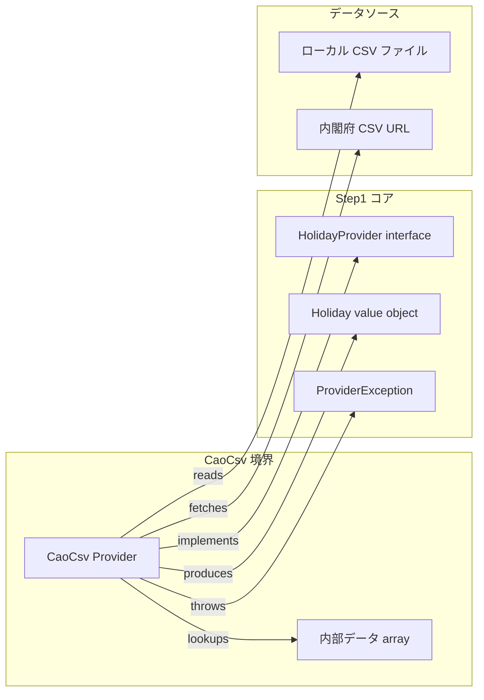
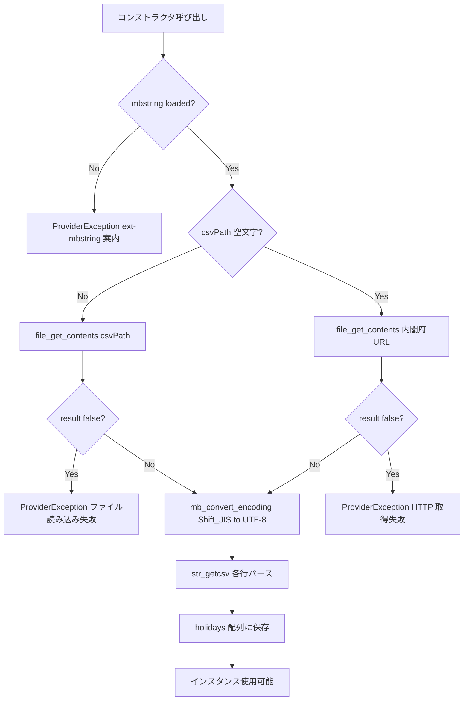

# 設計書: Step 3 — 内閣府CSVプロバイダー

## Overview

`CaoCsv\Provider` は内閣府が公開する「国民の祝日」CSV（`syukujitsu.csv`）を祝日データソースとして使用する `HolidayProvider` 実装である。ローカルCSVファイルとオンライン取得の2つのモードをサポートし、PHP 標準機能（`file_get_contents`・`mb_convert_encoding`・`str_getcsv`）のみで実装する。追加の Composer 依存はゼロ。

Step 2 で完成した `HolidayJp\Provider` と同一の `HolidayProvider` インターフェースを実装するため、利用者は `BusinessCalendar` のコンストラクタに渡すだけでプロバイダーを切り替えできる。

**Users**: ライブラリ利用者（`BusinessCalendar` を使うアプリケーション開発者）。公式データを使った祝日判定や、最新年のデータが必要な場合に `HolidayJp\Provider` の代替として選択する。

### Goals
- `HolidayProvider` インターフェースを内閣府CSV経由で実装する
- ローカルCSVとオンライン取得の両モードをサポートする
- 追加 Composer 依存ゼロで実装する（PHP 標準機能のみ使用）

### Non-Goals
- HTTP 取得のキャッシュ（インスタンス生成ごとに都度フェッチ — go-heijitu 踏襲）
- 内閣府以外の任意URLからのCSV取得（go-heijitu 踏襲）
- `BusinessCalendar` / `HolidayProvider` インターフェース / 他プロバイダーの変更
- `ext-mbstring` の自動インストール

---

## Boundary Commitments

### This Spec Owns
- `src/Providers/CaoCsv/Provider.php` の実装（`HolidayProvider` の全メソッド + コンストラクタ）
- ローカルCSVファイル読み込みとオンラインフェッチのモード制御ロジック
- Shift_JIS → UTF-8 変換と CSV パースの実装
- `ext-mbstring` 未導入時の `ProviderException` 検出と案内
- テストフィクスチャ（`tests/Providers/CaoCsv/testdata/syukujitsu_test.csv`、Shift_JIS）の作成
- `tests/Providers/CaoCsv/ProviderTest.php` の実装

### Out of Boundary
- `HolidayProvider` インターフェース（Step 1 で確定済み、変更禁止）
- `BusinessCalendar` の API・実装
- `HolidayJp\Provider` への変更
- `GoogleCalendar\Provider`（Step 4 スコープ）
- `ProviderException` / `Holiday` 値オブジェクト（Step 1 で確定済み）
- examples・PHPDoc・README（Step 5 スコープ）

### Allowed Dependencies
- `Heijitu\HolidayProvider` インターフェース — Step 1
- `Heijitu\Holiday` 値オブジェクト — Step 1
- `Heijitu\Exception\ProviderException` 例外型 — Step 1
- PHP 標準拡張 `ext-mbstring` — Shift_JIS デコード（`composer.json` の `suggest` に記載済み。未導入時は ProviderException で案内）
- PHP 標準関数 `file_get_contents`・`mb_convert_encoding`・`str_getcsv`・`DateTimeImmutable::createFromFormat`

### Revalidation Triggers
- `HolidayProvider` インターフェースのメソッドシグネチャ変更 → `CaoCsv\Provider` の再実装が必要
- `Holiday` 値オブジェクトのコンストラクタシグネチャ変更 → `holidaysBetween` の `Holiday` 構築箇所が影響を受ける
- `ProviderException` の継承関係変更 → コンストラクタの例外 throw が影響を受ける

---

## Architecture

### Existing Architecture Analysis

Step 1〜2 で確立したパターン（`CaoCsv\Provider` はこれらに準拠する）:
- `HolidayProvider` インターフェース（`isHoliday` / `holidayName` / `holidaysBetween`）
- `HolidayJp\Provider` の実装パターン（`final class`・コンストラクタ依存検出・`usort` 昇順ソート）
- `src/Providers/{Name}/Provider.php` ディレクトリ規則
- `tests/Providers/{Name}/ProviderTest.php` テスト配置規則

`CaoCsv\Provider` はこれらのパターンに従い、既存ファイルへの変更なしに追加できる。

### Architecture Pattern & Boundary Map



#### Architecture Integration

- パターン: `HolidayJp\Provider` と同一の「プロバイダーアダプター」パターン。データソースが異なるのみ。
- 依存方向: `CaoCsv\Provider` → Step 1 コア（`HolidayProvider` / `Holiday` / `ProviderException`）のみ
- 既存変更: なし（新規ファイル追加のみ）

### Technology Stack

| Layer | Choice / Version | Role in Feature | Notes |
|-------|------------------|-----------------|-------|
| Backend | PHP 7.4+ | プロバイダー実装全般 | PHP 7.4 構文・8.1 互換 |
| Data 取得 | `file_get_contents` (PHP 標準) | CSV 取得（ローカルパス・URL 両対応） | URL 取得時は `allow_url_fopen=On` 必須（PHP デフォルト値） |
| Encoding | `mb_convert_encoding` (ext-mbstring) | Shift_JIS → UTF-8 変換 | `suggest` 依存・未導入時はコンストラクタで ProviderException |
| Parsing | `str_getcsv` (PHP 標準) | CSV 行パース（2列形式） | ヘッダー行スキップ・不正行はスキップ |
| Date | `DateTimeImmutable::createFromFormat` (PHP 標準) | `'Y/m/d'` 形式 → DateTimeImmutable | PHP 7.4 標準 |

---

## File Structure Plan

### Directory Structure

```
src/
└── Providers/
    └── CaoCsv/
        └── Provider.php              # CaoCsv\Provider — HolidayProvider 実装本体（新規）

tests/
└── Providers/
    └── CaoCsv/
        ├── ProviderTest.php          # CaoCsv\Provider のユニットテスト（新規）
        └── testdata/
            └── syukujitsu_test.csv   # Shift_JIS テストフィクスチャ — 最小祝日データ（新規）
```

### Modified Files

- `.gitattributes` — `tests/Providers/CaoCsv/testdata/syukujitsu_test.csv binary` を追加（Shift_JIS ファイルの文字コード破損防止）
- `phpunit.xml` — `<groups><exclude><group>integration</group></exclude></groups>` を追加（通常の `phpunit` 実行時に `@group integration` テストを除外する）

> `.gitattributes` が存在しない場合は新規作成する。
> `phpunit.xml` の `<groups><exclude>` により、`vendor/bin/phpunit` だけで integration グループを除いた通常テストが実行できる。

---

## System Flows

### プロバイダー初期化フロー（コンストラクタ）



---

## Requirements Traceability

| Requirement | Summary | Components |
|-------------|---------|------------|
| 1.1 | HolidayProvider 実装クラスの提供 | CaoCsv\Provider（class 宣言） |
| 1.2 | ローカルCSVモード（csvPath 指定） | CaoCsv\Provider::__construct |
| 1.3 | オンライン取得モード（csvPath 未指定） | CaoCsv\Provider::__construct |
| 1.4 | Shift_JIS → UTF-8 デコード | parseAndStore（内部処理） |
| 1.5 | ローカルファイル読み込み失敗時の例外 | CaoCsv\Provider::__construct → ProviderException |
| 1.6 | HTTP 取得失敗時の例外 | CaoCsv\Provider::__construct → ProviderException |
| 2.1 | isHoliday: CSV 内の日付で true | CaoCsv\Provider::isHoliday |
| 2.2 | isHoliday: CSV 外の日付で false | CaoCsv\Provider::isHoliday |
| 2.3 | holidayName: CSV 内の日付で祝日名 | CaoCsv\Provider::holidayName |
| 2.4 | holidayName: CSV 外の日付で空文字 | CaoCsv\Provider::holidayName |
| 2.5 | holidaysBetween: 範囲内を昇順で返す | CaoCsv\Provider::holidaysBetween |
| 2.6 | holidaysBetween: from > to で空配列 | CaoCsv\Provider::holidaysBetween |
| 3.1 | mbstring 未導入時の ProviderException | CaoCsv\Provider::__construct |
| 4.1 | ProviderTest（ローカルフィクスチャ使用） | ProviderTest |
| 4.2 | ローカルCSVモードのテスト | ProviderTest |
| 4.3 | オンライン取得テストの @group integration 分離 | ProviderTest |
| 4.4 | PHP 7.4・8.1 両環境でのテスト通過 | ProviderTest（Docker 両バージョン） |

---

## Components and Interfaces

### Providers Layer

| Component | Domain/Layer | Intent | Req Coverage | Key Dependencies (P0/P1) | Contracts |
|-----------|--------------|--------|--------------|--------------------------|-----------|
| CaoCsv\Provider | Providers | 内閣府CSVを使った HolidayProvider 実装 | 1.1〜4.4 全件 | HolidayProvider (P0), ProviderException (P0) | Service |

#### CaoCsv\Provider

| Field | Detail |
|-------|--------|
| Intent | 内閣府CSV（ローカルまたはオンライン）をコンストラクタでパースし、HolidayProvider の全メソッドを実装する |
| Requirements | 1.1, 1.2, 1.3, 1.4, 1.5, 1.6, 2.1, 2.2, 2.3, 2.4, 2.5, 2.6, 3.1 |

**Responsibilities & Constraints**
- コンストラクタでCSVデータを取得・Shift_JIS デコード・パースし、内部配列 `$holidays` に保存する
- `isHoliday` / `holidayName` は `$holidays` への O(1) ハッシュ照合で実装する
- `holidaysBetween` は `$holidays` を範囲フィルタ + 昇順ソートして `Holiday[]` を返す
- `final class` で宣言する（HolidayJp\Provider と同規則）
- PHP 7.4 構文で実装し、8.1 での deprecation 警告が出ないようにする

**Dependencies**
- Inbound: なし（`BusinessCalendar` から `HolidayProvider` インターフェース経由で呼ばれる）
- Outbound: `Heijitu\Holiday` — 祝日値オブジェクト構築 (P0)
- Outbound: `Heijitu\Exception\ProviderException` — 依存検出・取得失敗時の例外 (P0)
- External: `ext-mbstring` — Shift_JIS デコード（`suggest` 依存、未導入時はコンストラクタで ProviderException）(P1)
- External: `file_get_contents` (PHP 標準) — CSV 取得（ローカルパス・URL 両対応）(P0)

**Contracts**: Service [x]

##### Service Interface

```php
namespace Heijitu\Providers\CaoCsv;

use Heijitu\Exception\ProviderException;
use Heijitu\Holiday;
use Heijitu\HolidayProvider;

final class Provider implements HolidayProvider
{
    /** @var array<string, string> キー: 'YYYY-MM-DD', 値: 祝日名 */
    private array $holidays;

    /**
     * @param string $csvPath ローカルCSVファイルパス。空文字のとき内閣府固定URLからオンライン取得。
     * @throws ProviderException ext-mbstring 未導入 / ファイル読み込み失敗 / HTTP 取得失敗
     */
    public function __construct(string $csvPath = '');

    public function isHoliday(\DateTimeImmutable $t): bool;
    public function holidayName(\DateTimeImmutable $t): string;

    /** @return Holiday[] */
    public function holidaysBetween(\DateTimeImmutable $from, \DateTimeImmutable $to): array;
}
```

- 事前条件: `extension_loaded('mbstring')` が true であること（false 時はコンストラクタで ProviderException）
- 事後条件: コンストラクタ正常終了後、`$holidays` に有効なデータが格納されている
- 不変条件: `$holidays` は `array<string, string>` 型（キー `'YYYY-MM-DD'`、値 祝日名）

**Implementation Notes**

- **コンストラクタ**: `extension_loaded('mbstring')` を先頭でチェック → 未導入なら ProviderException。`csvPath` 非空時は `file_get_contents($csvPath)`、空時は `file_get_contents(CABINET_OFFICE_CSV_URL)` でCSV取得。取得結果が `false` なら ProviderException。
- **内部定数**: 内閣府CSVの固定URL（`https://www8.cao.go.jp/chosei/shukujitsu/syukujitsu.csv`）は `private const CABINET_OFFICE_CSV_URL` で定義する。
- **CSV パース手順**: `mb_convert_encoding($content, 'UTF-8', 'SJIS-win')` → 行分割 → ヘッダー行スキップ → 各行 `str_getcsv($line)` → `[0]` が `'YYYY/MM/DD'`・`[1]` が祝日名 → `DateTimeImmutable::createFromFormat('Y/m/d', $row[0])` で変換し `format('Y-m-d')` をキーとして `$this->holidays` に保存。不正行（列数不足・日付変換失敗）はスキップ。エンコーディングに `'SJIS'` でなく `'SJIS-win'`（Windows-31J）を指定するのは、内閣府CSVが NEC 特殊文字・IBM 拡張文字を含む MS 拡張 Shift_JIS であるため。
- **isHoliday / holidayName**: `$key = $t->format('Y-m-d')` → `isset($this->holidays[$key])` / `$this->holidays[$key] ?? ''`
- **holidaysBetween**: `$from` / `$to` を `'Y-m-d'` 文字列に変換し `$holidays` をループで範囲フィルタ → `Holiday` 配列を生成 → `usort()` + スペースシップ演算子で昇順ソート（HolidayJp\Provider と同一パターン）
- **Risks**: テストフィクスチャ（Shift_JIS CSV）を git に正しく保存するため `.gitattributes` で `binary` 属性を設定する。これを忘れると `git` の自動 LF 変換で文字コードが破損する。

---

## Data Models

### Domain Model

内部データは `array<string, string>` 型のシンプルな連想配列:

- キー: `'YYYY-MM-DD'` 形式の日付文字列（CSV の `'YYYY/MM/DD'` を `DateTimeImmutable` 経由で変換）
- 値: 祝日名（Shift_JIS → UTF-8 変換後の文字列）

構築タイミング: コンストラクタ内でのみ。以降は読み取り専用。`holidaysBetween` も内部配列を変更しない。

---

## Error Handling

### Error Strategy

エラーはすべて `ProviderException` に変換してコンストラクタから throw する（HolidayJp\Provider と同一方針）。コンストラクタが正常終了した後の各メソッド（`isHoliday` / `holidayName` / `holidaysBetween`）はメモリ上の配列にアクセスするだけのため例外を throw しない。

### Error Categories and Responses

| エラー種別 | 発生タイミング | 処理 |
|-----------|--------------|------|
| `ext-mbstring` 未導入 | コンストラクタ先頭 | `ProviderException` — `ext-mbstring` のインストールを案内するメッセージ |
| ローカルファイル読み込み失敗 | コンストラクタ（csvPath 指定時） | `ProviderException` — ファイルパスを含む失敗メッセージ |
| HTTP 取得失敗 | コンストラクタ（csvPath 未指定時） | `ProviderException` — 内閣府URL到達不能を示すメッセージ |
| 不正な CSV 行 | コンストラクタ（パース中） | スキップ（一行の不正でパース全体を失敗させない） |

---

## Testing Strategy

### Unit Tests（`tests/Providers/CaoCsv/ProviderTest.php`）

テストフィクスチャ `tests/Providers/CaoCsv/testdata/syukujitsu_test.csv` は Shift_JIS エンコードで最低限の祝日データ（ヘッダー行 + 既知祝日数件）を含む。

1. **インターフェース実装確認** — `CaoCsv\Provider` が `HolidayProvider` を実装することを検証（1.1）
2. **isHoliday — true** — フィクスチャ内の既知祝日で `true` を返すことを検証（2.1）
3. **isHoliday — false** — 非祝日の日付で `false` を返すことを検証（2.2）
4. **holidayName — 祝日名返却** — フィクスチャ内の既知祝日で非空文字列を返すことを検証（2.3）
5. **holidayName — 空文字** — 非祝日の日付で `''` を返すことを検証（2.4）
6. **holidaysBetween — 範囲内祝日昇順返却** — `$from`〜`$to` 範囲の祝日を `Holiday[]` 昇順で返すことを検証（2.5）
7. **holidaysBetween — from > to で空配列** — 逆順の範囲で空配列を返すことを検証（2.6）
8. **holidaysBetween — 両端を含む** — `$from == $to == 祝日` のとき1件返すことを検証（2.5）
9. **holidaysBetween — 範囲外で空配列** — フィクスチャ祝日が含まれない範囲で空配列を返すことを検証（2.5）
10. **ローカルCSVモード確認** — `csvPath` 指定時にローカルファイルから正しく読み込むことを検証（1.2, 4.2）
11. **Holiday の date が DateTimeImmutable** — `holidaysBetween` 戻り値の `getDate()` が `DateTimeImmutable` であることを検証（2.5）

### Integration Tests（`@group integration`）

12. **オンライン取得モード** — `csvPath` 未指定時に内閣府URLからCSVを取得して正しく動作することを確認（1.3, 4.3）

### PHP バージョン確認

- Docker `php74` / `php81` サービスで `phpunit`（integration グループ除く）を実行し全テスト通過を確認（4.4）
