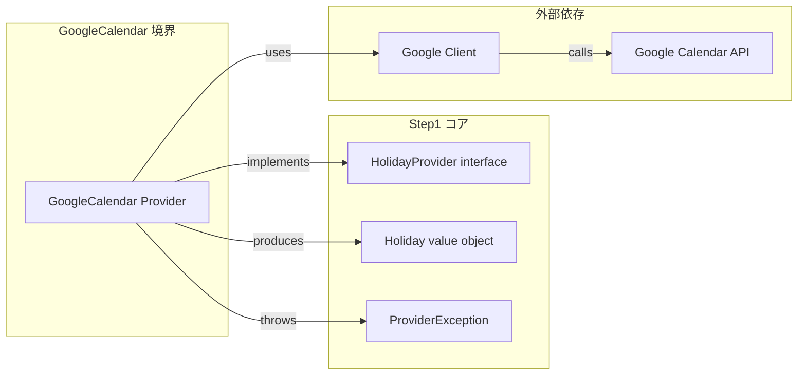
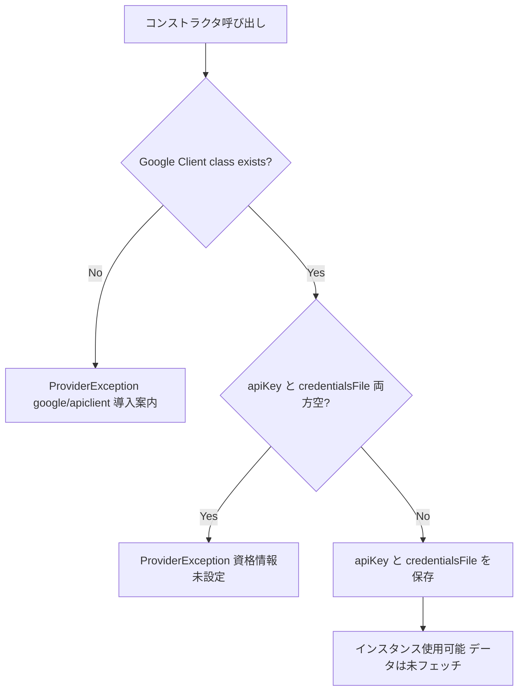
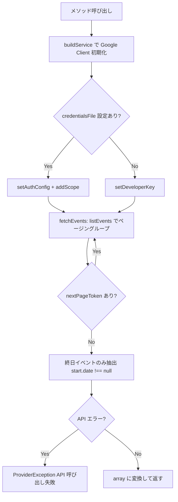

# 設計書: Step 4 — Google Calendar APIプロバイダー

## Overview

`GoogleCalendar\Provider` は Google Calendar API から日本の祝日データをリアルタイムに取得する `HolidayProvider` 実装である。API キー認証とサービスアカウント認証の両方をサポートし、`google/apiclient ~2.16.0` を外部依存として使用する。

Step 2・3 で確立した `HolidayProvider` インターフェースを実装するため、利用者は `BusinessCalendar` のコンストラクタに渡すだけで他プロバイダーと差し替えできる。データ取得は各メソッド呼び出し時にその都度 API へクエリする設計（クエリ都度取得）とし、コンストラクタではデータフェッチを行わない。

**Users**: ライブラリ利用者（`BusinessCalendar` を使うアプリケーション開発者）。最新の祝日データが必要な場合に `HolidayJp\Provider` や `CaoCsv\Provider` の代替として選択する。

### Goals
- `HolidayProvider` インターフェースを Google Calendar API 経由で実装する
- API キー認証とサービスアカウント認証の両方をサポートする
- PHP 7.4 構文で実装し PHP 8.1 でも型エラーなく動作する

### Non-Goals
- インスタンス内またはファイルシステム上のキャッシュ（クエリ都度取得 — go-heijitu 踏襲）
- `ja.japanese.official#holiday@group.v.calendar.google.com` 以外の Calendar ID の指定
- OAuth2 ユーザー認証
- `BusinessCalendar` / `HolidayProvider` インターフェース / 他プロバイダーの変更
- PHP 8.1 上の `google/apiclient` v2.16.x で発生する Deprecated Notice の排除（機能に影響しない既知の制約として受け入れ）

---

## Boundary Commitments

### This Spec Owns
- `src/Providers/GoogleCalendar/Provider.php` の実装（`HolidayProvider` の全メソッド + コンストラクタ）
- API キー認証・サービスアカウント認証の選択ロジック
- Google Calendar API 呼び出し・ページング・終日イベント抽出の実装
- `google/apiclient` 未導入時の `ProviderException` 検出と案内
- `composer.json` の `require-dev` への `google/apiclient ~2.16.0` 追加（Step 4 で実施）
- `tests/Providers/GoogleCalendar/ProviderTest.php` の実装

### Out of Boundary
- `HolidayProvider` インターフェース（Step 1 で確定済み、変更禁止）
- `BusinessCalendar` の API・実装
- `HolidayJp\Provider` / `CaoCsv\Provider` への変更
- `ProviderException` / `Holiday` 値オブジェクト（Step 1 で確定済み）
- examples・PHPDoc・README（Step 5 スコープ）
- `google/apiclient` の利用者への提供方法（`suggest` のみ — Step 1 で確定済み）

### Allowed Dependencies
- `Heijitu\HolidayProvider` インターフェース — Step 1
- `Heijitu\Holiday` 値オブジェクト — Step 1
- `Heijitu\Exception\ProviderException` 例外型 — Step 1
- `google/apiclient ~2.16.0`（`require-dev` + `suggest`） — Google Calendar API クライアント
- `DateTimeImmutable`・`DateInterval`（PHP 標準）

### Revalidation Triggers
- `HolidayProvider` インターフェースのメソッドシグネチャ変更 → `GoogleCalendar\Provider` の再実装が必要
- `Holiday` 値オブジェクトのコンストラクタシグネチャ変更 → `holidaysBetween` の `Holiday` 構築箇所が影響を受ける
- `ProviderException` の継承関係変更 → コンストラクタ・各メソッドの例外 throw が影響を受ける
- `google/apiclient` が v2.17+ に更新された場合 → PHP 7.4 互換が壊れるため `~2.16.0` の固定を維持する

---

## Architecture

### Existing Architecture Analysis

Step 1〜3 で確立したパターン（`GoogleCalendar\Provider` はこれらに準拠する）:
- `HolidayProvider` インターフェース（`isHoliday` / `holidayName` / `holidaysBetween`）
- プロバイダーアダプターパターン（`final class` / コンストラクタ依存検出 / 例外伝播）
- `src/Providers/{Name}/Provider.php` ディレクトリ規則
- `tests/Providers/{Name}/ProviderTest.php` テスト配置規則

`CaoCsv\Provider` との主な相違点:
- データをコンストラクタでロードせずメソッド呼び出し時に都度フェッチする
- 外部ライブラリ（`google/apiclient`）への依存がある
- 認証情報の検証をコンストラクタで行う

### Architecture Pattern & Boundary Map



- パターン: `HolidayJp\Provider` / `CaoCsv\Provider` と同一の「プロバイダーアダプター」パターン
- 依存方向: `GoogleCalendar\Provider` → Step 1 コア + `google/apiclient`
- 既存変更: `composer.json` のみ（`require-dev` への `google/apiclient ~2.16.0` 追加）

### Technology Stack

| Layer | Choice / Version | Role in Feature | Notes |
|-------|------------------|-----------------|-------|
| Backend | PHP 7.4+ | プロバイダー実装全般 | PHP 7.4 構文・8.1 互換 |
| API Client | `google/apiclient ~2.16.0` | Google Calendar API への HTTP 通信・認証 | PHP 7.4 互換の最終バージョン系列。v2.17+ は PHP 8.1 以上必須のため固定 |
| Auth: API Key | `Google\Client::setDeveloperKey()` | 公開カレンダー読み取り（祝日カレンダーに十分） | GCP で発行した API キー |
| Auth: Service Account | `Google\Client::setAuthConfig()` + `addScope()` | サービスアカウント認証 | JSON キーファイルのパス |
| Calendar Service | `Google\Service\Calendar` | イベント一覧取得（`events->listEvents()`） | `apiclient-services` は `google/apiclient` の transitive 依存 |

---

## File Structure Plan

### Directory Structure

```
src/
└── Providers/
    └── GoogleCalendar/
        └── Provider.php              # GoogleCalendar\Provider — HolidayProvider 実装本体（新規）

tests/
└── Providers/
    └── GoogleCalendar/
        └── ProviderTest.php          # GoogleCalendar\Provider のユニットテスト（新規）
```

### Modified Files

- `composer.json` — `require-dev` に `"google/apiclient": "~2.16.0"` を追加（Step 4 で実施）

---

## System Flows

### プロバイダー初期化フロー（コンストラクタ）



### メソッド呼び出しフロー（isHoliday / holidayName / holidaysBetween）



---

## Requirements Traceability

| Requirement | Summary | Components |
|-------------|---------|------------|
| 1.1 | HolidayProvider 実装クラスの提供 | `GoogleCalendar\Provider`（class 宣言） |
| 1.2 | Google 祝日カレンダーへの接続 | `buildService` + `fetchEvents` |
| 1.3 | 全件取得（ページング対応） | `fetchEvents` 内の `getNextPageToken()` ループ |
| 1.4 | 取得データをクエリに利用可能 | `fetchEvents` が `array<string, string>` を返し各メソッドが利用 |
| 1.5 | API エラー時の ProviderException | `fetchEvents` 内の try/catch → `ProviderException` |
| 2.1 | API キー認証 | `buildService` → `setDeveloperKey($this->apiKey)` |
| 2.2 | サービスアカウント認証 | `buildService` → `setAuthConfig($this->credentialsFile)` + `addScope` |
| 2.3 | credentialsFile 優先 | `buildService` 内の if/else 分岐 |
| 2.4 | 両方空でコンストラクタ例外 | `__construct` での検証 → `ProviderException` |
| 2.5 | コンストラクタ引数で受け取る（env 非読み取り） | `__construct(string $apiKey, string $credentialsFile)` |
| 3.1 | isHoliday: 祝日で true | `isHoliday` → `fetchEvents($t, $t)` → key 存在確認 |
| 3.2 | isHoliday: 非祝日で false | `isHoliday` → `fetchEvents($t, $t)` → key 非存在 |
| 3.3 | holidayName: 祝日で名前返却 | `holidayName` → `fetchEvents($t, $t)` → 値返却 |
| 3.4 | holidayName: 非祝日で空文字 | `holidayName` → `fetchEvents($t, $t)` → `?? ''` |
| 3.5 | holidaysBetween: 範囲内を昇順返却 | `holidaysBetween` → `fetchEvents($from, $to)` → `Holiday[]` ソート |
| 3.6 | holidaysBetween: from > to で空配列 | `holidaysBetween` 先頭でのアーリーリターン |
| 4.1 | google/apiclient 未導入時の ProviderException | `__construct` での `class_exists` チェック |
| 5.1 | 契約テスト（資格情報なし → 例外） | `ProviderTest::testThrowsWhenNoCredentials` |
| 5.2 | 実 API テストを @group integration で分離 | `ProviderTest` |
| 5.3 | PHP 7.4・8.1 でのテスト通過 | `ProviderTest`（Docker 両バージョン） |
| 5.4 | オートロード・型エラーなし | クラス定義・型宣言が PHP 7.4 構文に準拠 |
| 5.5 | integration テストが環境変数から資格情報を読む | `ProviderTest` 内 `getenv('GOOGLE_API_KEY')` / `getenv('GOOGLE_CREDENTIALS_FILE')` |

---

## Components and Interfaces

### Providers Layer

| Component | Domain/Layer | Intent | Req Coverage | Key Dependencies (P0/P1) | Contracts |
|-----------|--------------|--------|--------------|--------------------------|-----------|
| GoogleCalendar\Provider | Providers | Google Calendar API を使った HolidayProvider 実装 | 1.1〜5.5 全件 | HolidayProvider (P0), ProviderException (P0), google/apiclient (P0) | Service |

#### GoogleCalendar\Provider

| Field | Detail |
|-------|--------|
| Intent | Google Calendar API から祝日データをクエリ都度取得し、HolidayProvider の全メソッドを実装する |
| Requirements | 1.1, 1.2, 1.3, 1.4, 1.5, 2.1, 2.2, 2.3, 2.4, 2.5, 3.1, 3.2, 3.3, 3.4, 3.5, 3.6, 4.1 |

**Responsibilities & Constraints**
- コンストラクタでは資格情報を検証・保存するのみ。API フェッチはしない。
- 各 public メソッドは `buildService()` でクライアントを初期化し `fetchEvents()` で API からデータを取得する
- `fetchEvents()` はページング（`getNextPageToken()` ループ）を処理し、終日イベントのみを `array<string, string>`（キー: `'YYYY-MM-DD'`、値: 祝日名）で返す
- `final class` で宣言する（他プロバイダーと同規則）
- PHP 7.4 構文で実装する

**Dependencies**
- Inbound: なし（`BusinessCalendar` から `HolidayProvider` インターフェース経由で呼ばれる）
- Outbound: `Heijitu\Holiday` — 祝日値オブジェクト構築 (P0)
- Outbound: `Heijitu\Exception\ProviderException` — 依存検出・認証不備・API 失敗時の例外 (P0)
- External: `google/apiclient ~2.16.0` — Google Calendar API クライアント・認証 (P0)

**Contracts**: Service [x]

##### Service Interface

```php
namespace Heijitu\Providers\GoogleCalendar;

use Heijitu\Exception\ProviderException;
use Heijitu\Holiday;
use Heijitu\HolidayProvider;

final class Provider implements HolidayProvider
{
    /** Google Calendar の日本祝日カレンダー ID（固定） */
    private const CALENDAR_ID = 'ja.japanese.official#holiday@group.v.calendar.google.com';

    /** @var string */
    private $apiKey;

    /** @var string */
    private $credentialsFile;

    /**
     * @param string $apiKey          GCP で発行した API キー。credentialsFile が指定された場合は無視される。
     * @param string $credentialsFile サービスアカウント JSON キーファイルのパス。指定時は apiKey より優先される。
     * @throws ProviderException google/apiclient 未導入 / apiKey と credentialsFile が両方空
     */
    public function __construct(string $apiKey = '', string $credentialsFile = '');

    /**
     * @throws ProviderException API 呼び出し失敗
     */
    public function isHoliday(\DateTimeImmutable $t): bool;

    /**
     * @throws ProviderException API 呼び出し失敗
     */
    public function holidayName(\DateTimeImmutable $t): string;

    /**
     * @return Holiday[]
     * @throws ProviderException API 呼び出し失敗
     */
    public function holidaysBetween(\DateTimeImmutable $from, \DateTimeImmutable $to): array;

    /**
     * Google\Client を初期化して Google\Service\Calendar を返す。
     * credentialsFile が設定されていればサービスアカウント認証、そうでなければ API キー認証を使用する。
     *
     * @return \Google\Service\Calendar
     */
    private function buildService(): object;

    /**
     * $from〜$to（両端含む）の終日イベントを Google Calendar API から全ページ取得し、
     * キー 'YYYY-MM-DD'・値 祝日名 の配列を返す。
     *
     * @return array<string, string>
     * @throws ProviderException API 呼び出し失敗
     */
    private function fetchEvents(\DateTimeImmutable $from, \DateTimeImmutable $to): array;
}
```

- 事前条件: `$apiKey` と `$credentialsFile` のいずれか一方以上が非空（コンストラクタで検証済み）
- 事後条件: `fetchEvents` 正常終了後、戻り値は `array<string, string>` 型（キー `'YYYY-MM-DD'`、値 祝日名）
- 不変条件: `CALENDAR_ID` は変更不可の固定値

**Implementation Notes**

- **コンストラクタ**: `class_exists(\Google\Client::class)` でライブラリ導入確認 → 未導入なら `ProviderException`。`$apiKey` と `$credentialsFile` が両方空なら `ProviderException`。それ以外はプロパティに保存するのみ。
- **buildService()**: `credentialsFile` が非空なら `$client->setAuthConfig($this->credentialsFile)` + `$client->addScope(\Google\Service\Calendar::CALENDAR_READONLY)`。そうでなければ `$client->setDeveloperKey($this->apiKey)`。`new \Google\Service\Calendar($client)` を返す。
- **fetchEvents()**: 内部で `buildService()` を呼びクライアントを初期化する（public メソッドは `$this->fetchEvents(...)` のみを呼ぶ。`buildService()` と API 呼び出しの両方のエラーをこの1箇所の try/catch で `ProviderException` に変換する）。`timeMin` = `$from->setTime(0, 0, 0)->format('c')`、`timeMax` = `$to->modify('+1 day')->setTime(0, 0, 0)->format('c')`。API パラメータ: `singleEvents=true`、`orderBy=startTime`、`maxResults=2500`（日本の年間祝日数は約 16〜20 件のため、数十年分を一括取得するのに十分な値）。`getNextPageToken()` が空になるまでループ。`$event->getStart()->getDate() !== null` の終日イベントのみ対象。
- **isHoliday / holidayName**: `$events = $this->fetchEvents($t, $t)` → `$key = $t->format('Y-m-d')` → `isset($events[$key])` / `$events[$key] ?? ''`
- **holidaysBetween**: `$from > $to` のときアーリーリターン（空配列）。`$events = $this->fetchEvents($from, $to)` → `Holiday[]` を構築 → `usort()` で昇順ソート（他プロバイダーと同一パターン）。
- **PHP 8.1 deprecation 警告**: `google/apiclient` v2.16.x は PHP 8.1 で Deprecated Notice（暗黙的 nullable 等）を出すが、機能に影響はない。既知制約として受け入れる（decisions.md D-4 参照）。
- **Risks**: `google/apiclient ~2.16.0` の `~` 固定を `composer.json` で維持すること。`^2.16` に変更すると v2.17+ が解決され PHP 7.4 互換が壊れる（research.md 制約 1 参照）。

---

## Error Handling

### Error Strategy

コンストラクタで資格情報の検証を行い、API 呼び出しエラーは `ProviderException` に変換して呼び出し元へ伝播する（他プロバイダーと同一方針）。

### Error Categories and Responses

| エラー種別 | 発生タイミング | 処理 |
|-----------|--------------|------|
| `google/apiclient` 未導入 | コンストラクタ先頭 | `ProviderException` — `composer require google/apiclient` を案内するメッセージ |
| API キー・資格情報ファイル 両方未設定 | コンストラクタ | `ProviderException` — 認証情報の指定方法を案内するメッセージ |
| Google Calendar API 呼び出し失敗 | `fetchEvents` 内 | `ProviderException` — API エラーの詳細を含むメッセージ。元例外を `$previous` として連鎖 |

---

## Testing Strategy

### Unit Tests（`tests/Providers/GoogleCalendar/ProviderTest.php`）

1. **資格情報なし → コンストラクタ例外** — `apiKey` と `credentialsFile` 両方空で `ProviderException` が投げられることを検証（2.4, 5.1）
2. **HolidayProvider 実装確認** — `GoogleCalendar\Provider` が `HolidayProvider` を実装することを検証（1.1）

### Integration Tests（`@group integration`、環境変数 `GOOGLE_API_KEY` / `GOOGLE_CREDENTIALS_FILE` 必須）

3. **API キー認証での isHoliday** — `GOOGLE_API_KEY` 使用時に既知祝日で `true`、非祝日で `false` を返すことを確認（2.1, 3.1, 3.2, 5.5）
4. **API キー認証での holidayName** — 祝日で名前を、非祝日で空文字を返すことを確認（3.3, 3.4）
5. **API キー認証での holidaysBetween** — 指定範囲の祝日を `Holiday[]` 昇順で返すことを確認（3.5, 3.6）
6. **ページング確認** — 複数ページが存在するほど広い期間で全件取得できることを確認（1.3）

### PHP バージョン確認

- Docker `php74` / `php81` サービスで `phpunit`（integration グループ除く）を実行し全テスト通過を確認（5.3, 5.4）

---

## Security Considerations

- 認証情報（API キー・資格情報ファイルパス）はプロパティに保存される。ログ・デバッグ出力への認証情報の露出を防ぐこと。
- サービスアカウントの JSON キーファイルはファイルシステム上に存在するため、利用者はファイルのパーミッション管理（webサーバーから読めないよう制限）の責任を持つ。これはライブラリの制御外。
- `credentialsFile` が存在しないパスを指定した場合、`google/apiclient` 内部でエラーが発生するため、`buildService()` の try/catch で `ProviderException` に変換する。
